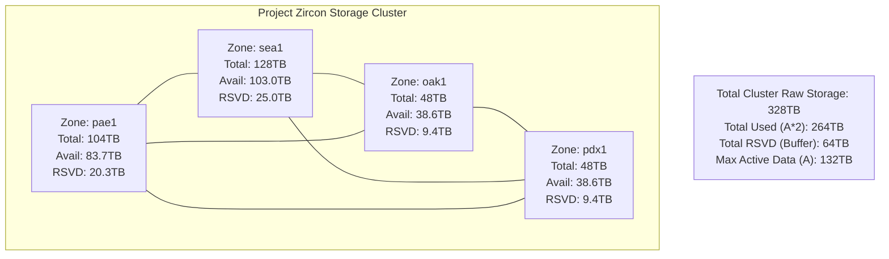
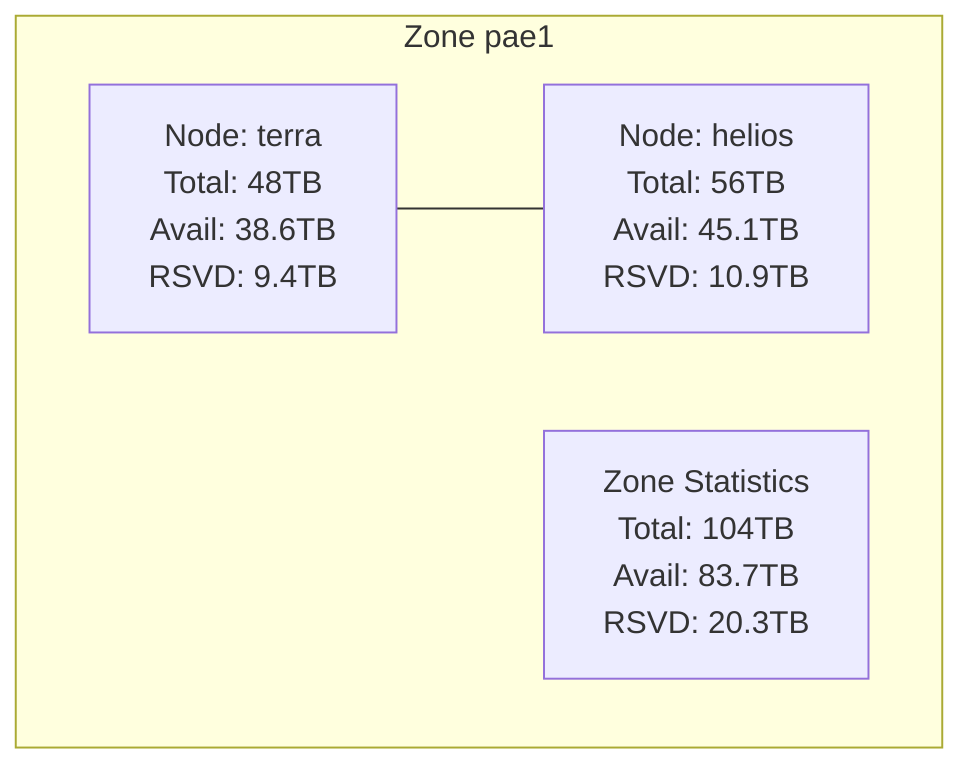
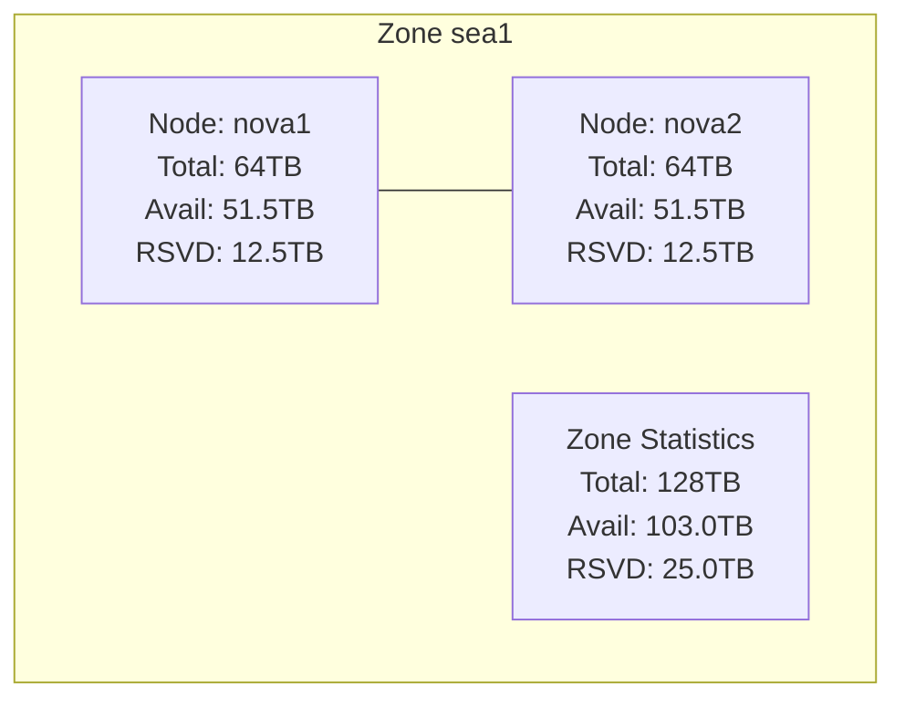
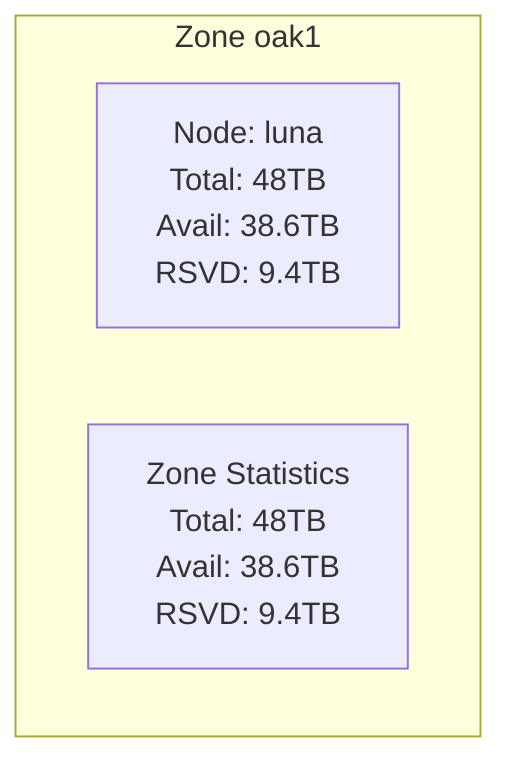
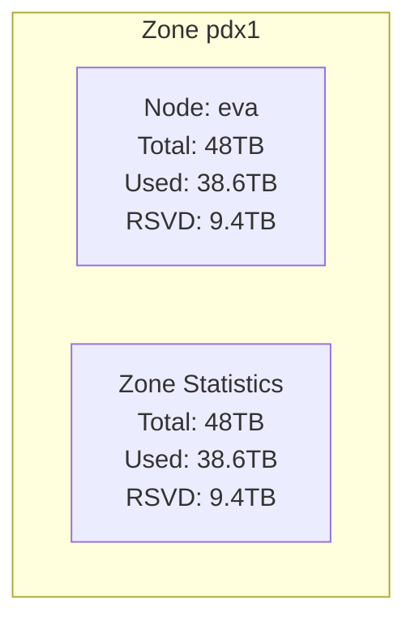
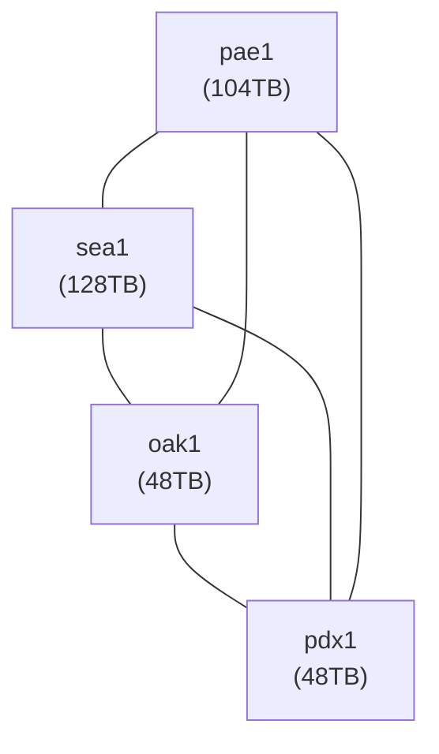

# Project Zircon: Distributed Storage Cluster

## Summary

Project Zircon is a collaborative, distributed storage cluster designed for resilience and large-scale data management. It operates on a 2x replication factor, meaning every piece of active data (`A`) is stored twice across the cluster (`A * 2`). The cluster is designed to tolerate the failure of any **single largest node**, requiring enough total raw storage to reconstitute the data from that failed node. Members contribute raw storage capacity through dedicated nodes or expanding existing ones with hard drives or donations.

This document outlines the system architecture, storage calculations, and recovery buffer strategy.

## Storage Replication and Recovery Buffer

Project Zircon maintains a **2x replication factor** for all active data (`A`). This ensures data redundancy during normal operation.

To handle the failure of the **single largest node** in the cluster, the cluster must maintain sufficient **total raw storage (`S_total`)** to absorb the data from the **single largest node (`T_largest_node`)** and allow for its data to be replicated again to restore the 2x factor across all active data.

**Calculation for Minimum Total Cluster Raw Storage (`S_required`):**
The minimum total raw storage required across all zones is calculated as:
`S_required = (A * 2) + T_largest_node`

Where:
*   `A` = Desired total active data footprint.
*   `A * 2` = Raw storage needed for 2x replication of active data.
*   `T_largest_node` = Total raw storage capacity of the single largest node in the cluster. This represents the cluster-level recovery buffer needed.

Conversely, given the current total raw storage (`S_total`) and the largest node (`T_largest_node`), the maximum supportable active data footprint (`A_max`) is:
`A_max = (S_total - T_largest_node) / 2`

The cluster's **Total Available Storage** (`S_total - (A * 2)`) must always be greater than or equal to `T_largest_node`.

## Current Cluster Status

Based on the current total raw storage (`S_total` = 328 TB) and the largest node (nova1/nova2, `T_largest_node` = 64 TB), the maximum supportable active data footprint (`A_max`) is 132 TB.

*   **Largest Node:** `nova1`/`nova2` (64 TB each)
*   **Required Cluster-Level Buffer (for single largest node failure):** 64 TB
*   **Maximum Supported Active Data (`A_max`):** 132 TB
*   **Implied Total Used Storage (`A_max * 2`):** 264 TB
*   **Current Total Available Storage (Buffer):** 328 TB - 264 TB = 64 TB
*   **Buffer Requirement Met:** Yes (64 TB >= 64 TB)

The following table shows the distribution based on `A_max = 132 TB`:

| Zone | Node Name      | Total Raw Storage (TB) | Available Storage (TB)    | Reserve Storage (TB)           |
| :--- | :------------- | :--------------------- | :------------------------ | :----------------------------- |
| pae1 | terra          | 48                     | 38.6                      | 9.4                            |
| pae1 | helios         | 56                     | 45.1                      | 10.9                           |
|      | **Zone Total** | **104**                | **83.7**                  | **20.3**                       |
| sea1 | nova1          | 64                     | 51.5                      | 12.5                           |
| sea1 | nova2          | 64                     | 51.5                      | 12.5                           |
|      | **Zone Total** | **128**                | **103.0**                 | **25.0**                       |
| oak1 | luna           | 48                     | 38.6                      | 9.4                            |
|      | **Zone Total** | **48**                 | **38.6**                  | **9.4**                        |
| pdx1 | eva            | 48                     | 38.6                      | 9.4                            |
|      | **Zone Total** | **48**                 | **38.6**                  | **9.4**                        |
| ---  |                |                        |                           |                                |
|      | **Total**      | **328**                | **264.0**                 | **64.0**                       |

## System Map

### High-Level Cluster Overview

### Zone: pae1 (104TB Total)

### Zone: sea1 (128TB Total)

### Zone: oak1 (48TB Total)

### Zone: pdx1 (48TB Total)

### Inter-Zone Data Pathways

## Footnotes and Additional Information

-  **Storage Units**: All storage capacities and usage are presented in Terabytes (TB).
-  **Total Raw Storage**: The total physical storage capacity contributed by a node or zone.
-  **Implied Available Storage**: Calculated based on the maximum supported active data (`A_max` = 132 TB) replicated twice (`A_max * 2` = 264 TB total) and distributed proportionally across nodes/zones based on their `Total Raw Storage`. This represents the usage if the cluster were fully utilized up to its maximum supportable active data limit.
-  **Implied Reserved Storage**: Calculated as `Total Raw Storage - Implied Available Storage`. The sum of this across all zones constitutes the cluster-level recovery buffer, which must be at least equal to the size of the **single largest node** (64 TB).
-  **Inter-Zone Links**: The connections depicted in the system map represent logical data pathways or primary replication relationships. The actual network topology might be more intricate.
-  **Member Contribution**: Member contributions must collectively ensure the cluster\'s `Total Raw Storage` is sufficient to meet the `S_required = (A * 2) + T_largest_node` formula for the desired active data footprint (`A`).
-  **Data Distribution**: The `client-sync` script facilitates managing data movement and backup operations between nodes and zones, contributing to the overall resilience strategy of Project Zircon.
