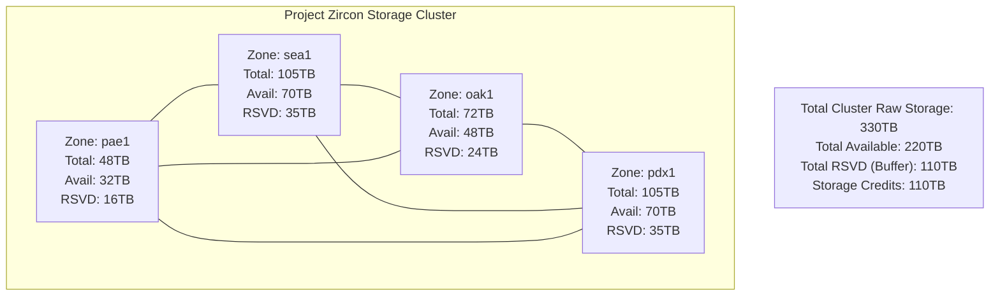
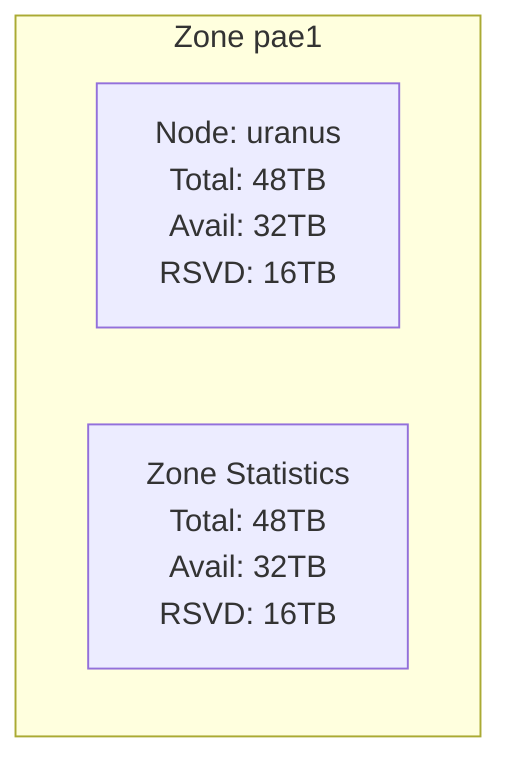
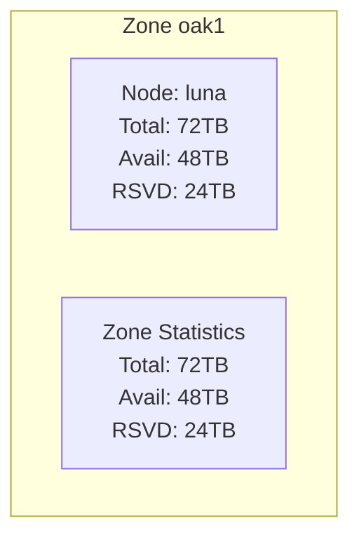
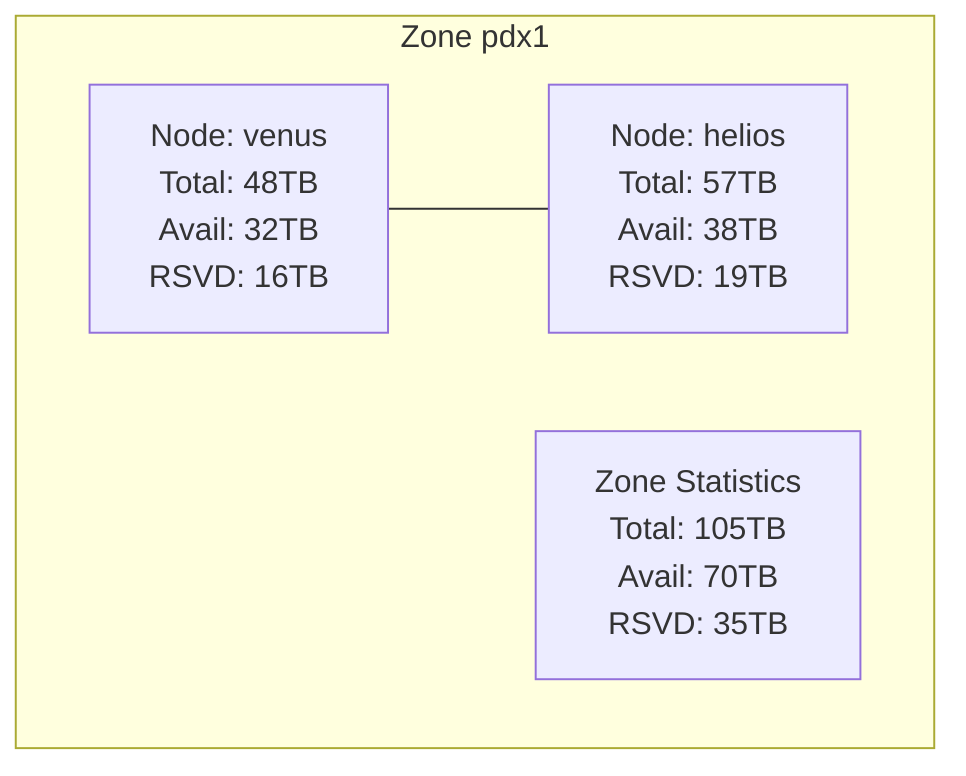
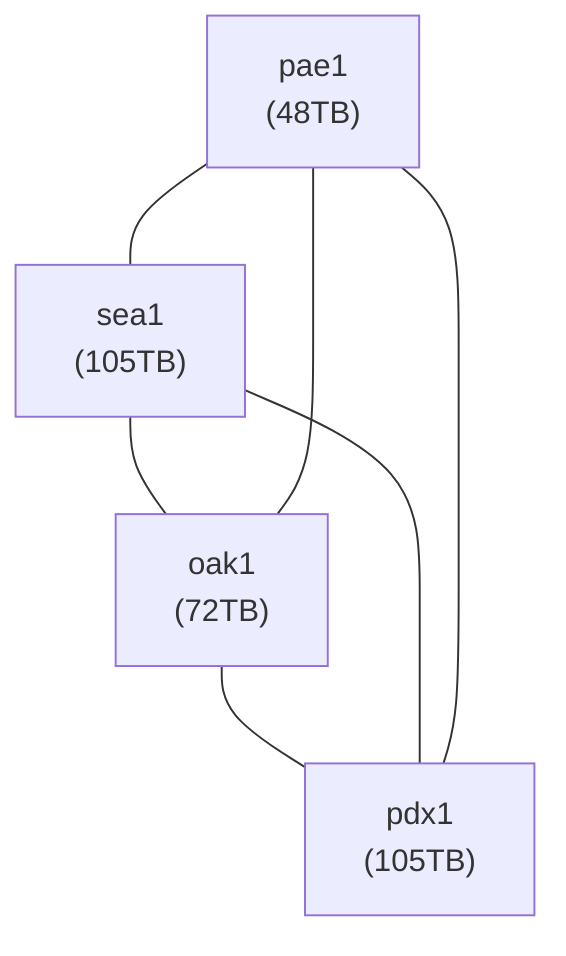

# Project Zircon: Distributed Storage Cluster

## Membership

Membership in Project Zircon is based on contribution to the cluster's resources. The goal of this cluster is to provide safe and reliable backup to all memebers. Understand that this network is support by home networks with the goal of shared storage. Here are some basic requirements for members:
1. Members are not allowed to use this service for illegal services or activities. 
2. Members buckets maximum size will be limited, do not exceed those limits.
3. Limit transfer speeds to 100MiB/s. Limit network traffic to less than 10TB per month.

In addition, all members are expected to adhere to the following guidelines:  

### Contribution Requirements

To be an active member, individuals or entities must fulfill one of the following:

*   **Contribute Storage:** Provide raw storage capacity to the cluster through dedicated nodes or by expanding existing ones.
*   **Borrow Storage:** Arrange to utilize storage allocated to another member, with mutual agreement.

For Example:
> **Storage Contribution Formula:** The calculation is straightforward - take the maximum amount of data you wish to store and multiply it by 3. This represents the raw storage you need to provide, borrow, or donate.
> 
> *Example:* If a member provides 30TB of raw storage, they would be allocated a maximum bucket size of 10TB.
> 
> *Rationale:* When data is stored on the network, it is replicated so that there are two copies distributed. In the event of a node failure, data will be automatically re-replicated to maintain redundancy while the cluster undergoes repair. This approach ensures your data remains protected during failure scenarios, and includes overhead so that none of the nodes are ever 100% full.

### Public Ledger and Accountability

A public ledger will be maintained to track each member's contributions (storage or financial). Their allocated storage usage will be visible on the bucket size limits.

*   **Storage Allocation:** Members will be allocated storage based on their contributions.
*   **Exceeding Allocation:** If a member using more storage than their allocated amount will have their API access keys switched to read-only mode.
*   **Public Endpoints:** Public endpoints are hosted on public cloud which charge $20 per 1TB of network traffic. If you use the public endpoint you will need to cover your network costs.

### Responsibilities for Storage Providers

Members who contribute storage by providing nodes have the following responsibilities:

*   **Node Uptime:** Storage providers must make a best-effort attempt to ensure their contributed nodes remain online and functional.
*   **Network Performance:** The node should have a low latency connection to the NAT and internet.
    * **Ping:** Less than 50ms to ensure responsive connections
    * **Bandwidth:** Minimum 150MiB/s for efficient upload and download
    * **Data Cap:** Minimum 5 TB monthly data allowance
*   **Node Performance:** The node must provide reasonable data speeds and low latency.
    * **Read:** Atleast 500 MiB/s
    * **Write:** Atleast 250 MiB/s
    * **Data Storage:** XFS, ZFS, BRTFS configured as a pool, volume or individual disks. You must ensure that your stated capacity and disk space align, ie - don't allow other applications to consume the capacity you are sharing with the pool.
    * **Metadata Storage:** ZFS, BTRFS configured as a pool or volume. This will store the config, node data, database, and database snapshots. Supports either LMDB or SQLite and needs to be backed up.

### Data Retention Policy

*   **Uncovered Data:** Any data stored on the cluster that is not covered by a member's active storage contribution will be subject to deletion after a period of three (3) months.
*   **Node Failure:** In the event of a catastrophic node failure, data that is not covered by sufficient contributions may also be subject to loss, as per the cluster's overall resilience and replication strategy.

## Network Summary

Project Zircon is a collaborative, distributed storage cluster designed for resilience and large-scale data management. It operates on a 2x replication factor, meaning every piece of active data (`A`) is stored twice across the cluster (`A * 2`). The cluster is designed to tolerate the failure of any **single largest node**, requiring enough total raw storage to reconstitute the data from that failed node. Members contribute raw storage capacity through dedicated nodes or expanding existing ones with hard drives or donations.

This document outlines the system architecture, storage calculations, and recovery buffer strategy.

## Storage Replication and Recovery Buffer

Project Zircon maintains a **2x replication factor** for all active data (`A`). This ensures data redundancy during normal operation.

To handle the failure of any zone, we will leave a buffer of 1/3 of the available storage. The combined storage of all members should not exceed this, so than when a zone or node is lost replication can begin immedately.

## Current Cluster Status

| Zone | Node Name      | Total Raw Storage (TB) | Available Storage (TB)    | Reserve Storage (TB)  | Storage Credit (TB) |
| :--- | :------------- | :--------------------- | :------------------------ | :-------------------- | :------------------ |
| pae1 | uranus         | 48                     | 32                        | 16                    | 16                  |
|      | **Zone Total** | **48**                 | **32**                    | **16**                | **16**              |
| sea1 | mars           | 57                     | 38                        | 19                    | 19                  |
| sea1 | terra          | 48                     | 32                        | 16                    | 16                  |
|      | **Zone Total** | **105**                | **70**                    | **35**                | **35**              |
| oak1 | luna           | 72                     | 48                        | 24                    | 24                  |
|      | **Zone Total** | **72**                 | **48**                    | **24**                | **24**              |
| pdx1 | venus          | 48                     | 32                        | 16                    | 16                  |
| pdx1 | helios         | 57                     | 38                        | 19                    | 19                  |
|      | **Zone Total** | **105**                | **70**                    | **35**                | **35**              |
| ---  |                |                        |                           |                       |                     |
|      | **Total**      | **330**                | **220**                   | **110**               | **110**             |

## System Map

### High-Level Cluster Overview

### Zone: pae1 (48TB Total)

### Zone: sea1 (105TB Total)

### Zone: oak1 (72TB Total)

### Zone: pdx1 (105TB Total)

### Inter-Zone Data Pathways

## Footnotes and Additional Information

-  **Storage Units**: All storage capacities and usage are presented in Terabytes (TB).
-  **Total Raw Storage**: The total physical storage capacity contributed by a node or zone.
-  **Implied Available Storage**: Calculated based on the maximum supported active data (`A_max` = 132 TB) replicated twice (`A_max * 2` = 264 TB total) and distributed proportionally across nodes/zones based on their `Total Raw Storage`. This represents the usage if the cluster were fully utilized up to its maximum supportable active data limit.
-  **Implied Reserved Storage**: Calculated as `Total Raw Storage - Implied Available Storage`. The sum of this across all zones constitutes the cluster-level recovery buffer, which must be at least equal to the size of the **single largest node** (64 TB).
-  **Inter-Zone Links**: The connections depicted in the system map represent logical data pathways or primary replication relationships. The actual network topology might be more intricate.
-  **Member Contribution**: Member contributions must collectively ensure the cluster\'s `Total Raw Storage` is sufficient to meet the `S_required = (A * 2) + T_largest_node` formula for the desired active data footprint (`A`).
-  **Data Distribution**: The `client-sync` script facilitates managing data movement and backup operations between nodes and zones, contributing to the overall resilience strategy of Project Zircon.
